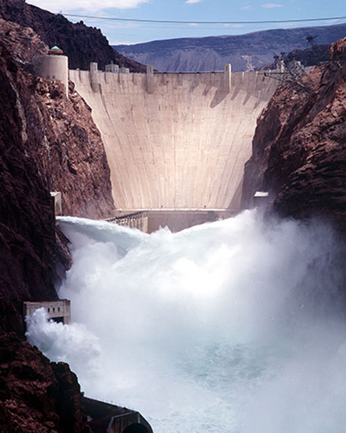

# USBR: Hydroelectric Dams and Power Plants Dataset

Web Scrape of the U.S. Bureau of Reclamation Hydroelectric dams and power plants data.

Link: [USBR plants & dams](https://usbr.gov/projects/)

### Summary

The data is collected using R, and shows an effective methodology for web scraping using the `{purrr}` package. The key is to model your crawl as a dataframe (or **Tibble**), and use `{purrr}` to collect HTML and extract content while managing errors with safe exception handling (ie. `{purrr::possibly()}`).

### Details

The data folder contains separate data sets for both power plants and dams managed by the USBR. There are likewise separate CSV files containing text summaries of each infrastructure project. Lastly, There are two zipped folders containg images associated with each project which can be linked across the data sets.

